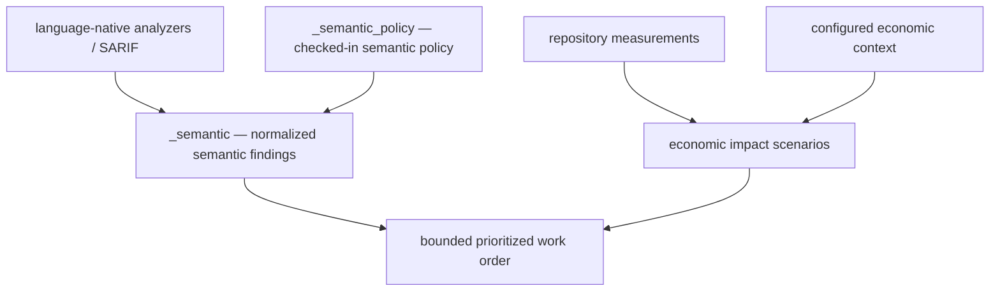

# Architecture

How the package is layered, which layer may depend on which, and the invariant each one owns.

This describes the code **as it is**, not as intended. Where reality falls short of a decision, it is listed under [Known debt](#known-debt) rather than described aspirationally. Direction of travel is kept in the [decision register](decisions.md); the explicitly labeled proposal section at the end maps those decisions onto the current layers without claiming they ship.

**Network boundary (as-is).** This agent does not transmit the audited tree and does not call an LLM. `_runner` is the only spawn point for analyzers besides `git_tools`. Those children are not network-sandboxed; this process does not police their sockets. `_npx` may run `npx --yes` when `analyzers.acquire_tools` is set and a Node binary is missing — acquisition, not analysis, still the internet. There is no seccomp / `unshare -n` wrap. See [P1](product-intent.md#what-it-promises).

The layering is enforced by `tests/test_architecture.py`, which reads the real import graph. A rule stated here and not enforced there is decoration, and this document tries not to contain any.

## Layers

Dependencies point downward only. No cycles. Every module in a box is a file under `src/maintainability_audit/`. `tests/test_architecture.py` fails the build if a layer set names a module this diagram omits.

```mermaid
flowchart TB
  subgraph entry["entry"]
    cli["cli"]
    _first_run["_first_run"]
    _mcp_setup["_mcp_setup"]
    _mcp_audit["_mcp_audit"]
    _mcp_gate["_mcp_gate"]
    _mcp_resources["_mcp_resources"]
    _mcp_grants["_mcp_grants"]
    _mcp_refusals["_mcp_refusals"]
    _skill_install["_skill_install"]
    dunder_main["__main__"]
    mcp_server["mcp_server"]
    _grant_ledger["_grant_ledger"]
  end

  subgraph presentation["presentation — reads the report dict"]
    renderers["renderers"]
    prompts["prompts"]
    sarif["sarif"]
    baseline["baseline"]
    _evidence_view["_evidence_view"]
    _scan_view["_scan_view"]
    _coverage_notes["_coverage_notes"]
    _html_view["_html_view"]
    _economics_view["_economics_view"]
    _semantic_view["_semantic_view"]
    _history_view["_history_view"]
    _identity["_identity"]
  end

  subgraph assembly["assembly — builds the report, calls the scorer once"]
    report["report"]
    _analysis["_analysis"]
    _documents["_documents"]
    _economics["_economics"]
    _environment["_environment"]
    _built_ins["_built_ins"]
    _work_order["_work_order"]
    _work_order_weights["_work_order_weights"]
    _backfill["_backfill"]
  end

  subgraph scanners["scanners"]
    metrics["metrics"]
    _discovery["_discovery"]
    _practice["_practice"]
    duplication["duplication"]
    deadcode["deadcode"]
    idioms["idioms"]
    similarity["similarity"]
    history["history"]
    _adapters["_adapters"]
    _generic["_generic"]
    _metric_adapters["_metric_adapters"]
    _verdict_adapters["_verdict_adapters"]
    _jvm_adapters["_jvm_adapters"]
    _tool_adapters["_tool_adapters"]
    _selection["_selection"]
    _semantic["_semantic"]
    _semantic_ts["_semantic_ts"]
  end

  subgraph scoring["scoring"]
    scoring_mod["scoring"]
    _aspects["_aspects"]
    _pressures["_pressures"]
    _pillars["_pillars"]
    _trends["_trends"]
    _recurrence["_recurrence"]
    _formula["_formula"]
    _calibration["_calibration"]
    _bands["_bands"]
    _corroborate["_corroborate"]
    _second_source["_second_source"]
    _verification["_verification"]
    _derive["_derive"]
  end

  subgraph boundary["boundary"]
    evidence["evidence"]
  end

  subgraph parsing["parsing"]
    source["source"]
    declarations["declarations"]
    _cognitive["_cognitive"]
    _ranges["_ranges"]
    _tokens["_tokens"]
    _xml["_xml"]
  end

  subgraph foundations["foundations"]
    _metrics_types["_metrics_types"]
    _masking["_masking"]
    _hotspots["_hotspots"]
    config["config"]
    _user_config["_user_config"]
    _stored_grants["_stored_grants"]
    _safe_write["_safe_write"]
    git_tools["git_tools"]
    _scan_history["_scan_history"]
    _finding_match["_finding_match"]
    instructions["instructions"]
    _runner["_runner"]
    _catalog["_catalog"]
    _semantic_policy["_semantic_policy"]
  end

  entry --> presentation
  presentation --> assembly
  assembly --> scanners
  assembly --> scoring
  scoring --> evidence
  scanners --> parsing
  scoring --> parsing
  parsing --> foundations
```

`_bands` sits in scoring because it is rubric data. Declaration and file-size pressures use it (3.2). `_finding_match` owns structured identity and matching; `_identity` presents the ordinal labels derived from the report. `_user_config` owns the XDG user configuration and per-repository seen state; it belongs beside `config` in foundations. `_safe_write` is the single way the agent writes into a tree it is auditing — bounded, symlink-refusing, staged and renamed so no existing inode is opened for writing — and sits in foundations for the same reason: every layer that writes must reach it, and it reaches nothing but `config` (D34). `_semantic` classifies type-backed findings; `_semantic_ts` supplies TypeScript type facts from recordings or an already-installed `tsc`; `_semantic_policy` loads the optional checked-in policy.

| Layer | Owns | May import |
| --- | --- | --- |
| **foundations** | Data types, config defaults, git invocation, masking primitives, `_finding_match` (structured identities plus the one matching relation used by gates and recurrence), and `_semantic_policy` | nothing internal except `_finding_match` using `git_tools` for rename evidence |
| **parsing** | Reading files once, extracting declarations, complexity, ranges, tokens | foundations |
| **scanners** | Producing findings: sizes, duplicates, dead code, idioms, near-duplicates, history, ADR 003 semantic classification (`_semantic`, `_semantic_ts`), and — via `_adapters` — whatever the external analyzers report; `_selection` composes the runnable set from the language inventory (D15) | foundations, parsing, `_runner` |
| **scoring** | Turning findings into aspects, categories, an overall, a grade, and whether the evidence supports verifying it (`_verification`) | foundations, parsing (types only), the evidence boundary |
| **assembly** | Running the scan, running the analyzer pool (`_analysis`) and stating what it found (`_documents`), the environment work order composed from coverage (`_environment`), recording the built-in detectors as their own source tier (`_built_ins`), ordering the work by risk against effort and recomputing each item's worth (`_work_order`, weights in `_work_order_weights`), assembling the report dict, invoking the scorer once | anything below |
| **presentation** | Markdown/chat, a self-contained HTML report, PR comment, SARIF, baseline, remediation prompt, `_evidence_view` (shared estimate/range/evidence/verified-grade wording), and `_identity` (labels and digests consumed from the report, never source). The renderers consume one report dictionary and do not score | foundations, the report dict |
| **entry** | Argument parsing, transport, output routing, exit codes, and the first-run TTY prompt (`_first_run`) and its chat-path twin (`_mcp_setup`, MCP elicitation) and the MCP audit tool itself (`_mcp_audit`, split from `mcp_server`) and the D10 root-grant machinery (`_mcp_grants`, same split) and the setup/run gate that answers with questions instead of a report (`_mcp_gate`) and the MCP resources, which answer reads and can never ask (`_mcp_resources`) and the set of refusals the transport may declare (`_mcp_refusals`, shared by both seam-binding modules so neither has to import the other) and the packaged-skill sync (`_skill_install`) — the one layer where the tool may ask a question | anything below |

## The rules, and why each exists

Each rule was bought by a specific failure. They are enforced, not advisory.

**1. Scoring may not import scanners or assembly.**
The rubric must not be able to reach back into how a finding was produced. If it could, a repo-specific special case would eventually be written and P2 (one uniform rubric) would fail silently.

**2. `_formula` and `_calibration` import nothing internal.**
They are the judgment layer — weights, bands, grade gates, the calibration constant — and they are data. A leaf cannot acquire a dependency on scanning, so the rubric cannot come to depend on what it is scoring.

**3. Presentation may not import the scoring internals.**
`renderers`, `prompts`, and `sarif` consume the report dictionary. Today they import only `_hotspots` (a formatting helper) and `config`. This keeps one path to a score: if a renderer could compute one, two numbers could disagree, which is the class of bug that produced an overall contradicting the categories printed beside it.

**4. `evidence` imports nothing internal.**
The normalization boundary is deliberately a leaf. Everything it needs arrives as an argument. This is what makes it a *boundary* rather than another participant — see [ADR 001](adr-001-evidence-and-verification.md) §3.

**5. The calibration derivation calls the shipped scorer.**
`_derive` imports `_aspects`, `_formula`, and `_pressures` and runs the same functions a live report runs. It may not restate the rollup. Three consecutive audits found the derivation differing from the live path by exactly one step — category rounding, then the untested cap, then per-aspect rounding — and each time the corpus median survived while the per-repository claim did not. "The same pipeline" is only true when there is one pipeline.

**6. No import cycles.**
One existed: `_derive` needed the scorer and the scorer needed the calibration, so `_derive` imported from inside a function body. Splitting `scoring` into `_pressures` / `_aspects` / `scoring` removed it. Cycles are how layering rots without anyone deciding to rot it.

**7. Only `_runner` runs analyzers; only `_runner`, `git_tools` and `_backfill` may spawn a process.**
Adapters describe invocations; they do not perform them. `_backfill` talks to git directly rather than through `git_tools` — a remaining inconsistency, not a third analyzer runner.

**8. Analyzer adapters may not import scoring.**
The same rule scanners already live under, for the same reason: an adapter that could see the rubric would eventually be tuned to it.

**9. Corroboration happens before the evidence boundary.**
`evidence` receives already-combined values with their strength and provenance. The boundary stays a leaf and stays the single normalization point; it does not learn about tools.

**10. `_practice` may not read source files.**
Practice level is a claim about enforcement, not about code. If it could read source, it would drift into being a second, uncalibrated condition score.

**11. Practice level and code condition are never combined.**
No function returns their average. [ADR 007](adr-007-pillars-and-practice.md) invariant 2 exists because a single composite number would destroy both.

**12. Only the transport declares anticipated refusals.**
The plain functions keep raising the domain types — `InvalidAuditArgument`, `PathNotAllowed`, `SetupRequired`, `StaleBaseline`, `PolicyError` and `ConfigUnreadable` — because the CLI and every library caller depend on them. At the entry seam, the transport translates only named anticipated refusals into the SDK's declared forms: `ToolError` from the audit tool, `ResourceError` from the report resource and its security validator, with the message reaching the caller. Everything else stays a crash: the caller gets `Error executing tool <name>` or a bare resource URI, and the traceback stays server-side so nothing internal leaks. The list lives in `_mcp_refusals.py` as `ANTICIPATED_REFUSALS`, re-exported from `mcp_server` — it sits below both seam-binding modules because `mcp_server` imports `_mcp_resources`, so a tuple beside either would be a cycle for the other. It is named types only, never bare `ValueError`: modules below the transport raise those with internal paths in the message. It is also the *whole* set of refusals a caller can act on — a type missing from it stops teaching just as surely as an undeclared one, which is why `StaleBaseline` belongs there: it travels this path for real, from `_baseline_workflow` through `findings_not_in_baseline` and `load_baseline_identities` to `_read`, and its message tells the caller to regenerate the baseline. `PolicyError` is in the tuple on different grounds, and the difference is stated because this sentence first claimed the same grounds for both and was wrong about one. `PolicyError` cannot presently reach any of the three seams: every site that raises it — `load_catalog`, `settings_from`, `resolve_pool` — is reachable only through `_analysis.analyze()`, which catches it and returns `Analysis(error=...)` instead of raising, exactly as that function's docstring promises. It is declared ahead of a seam-level configuration path that does not exist yet. Dropping it would be defensible today and would silently lose the remedy on the day such a path appears, because the derivation test below would by then count the type as already accounted for. `ConfigUnreadable` joined the tuple when the security branch introduced it: a configuration file that exists and cannot be parsed is a refusal the caller can act on, and its message names the file they pointed at. It carried a second path for a while — the interpolated `OSError` appends the OS filename, which for a symlinked config is the *target* — so it now reports `strerror` alone. `EvidenceValidationError` is excluded outright: on this path the report is built internally, so a failure in it is an internal bug. A reviewer eyeballing that list got it wrong twice in opposite directions; `test_every_named_exception_is_a_declared_refusal_or_excluded` classifies every named exception in the package (in the tuple, or excluded with a stated reason) and `test_the_transport_excepts_the_named_tuple_not_a_copy` holds the three seams to the tuple by name, across every transport module rather than one — it counted seams in `mcp_server` alone until the resource bindings moved out from under it. Before any of this was declared, `mcp` 2.1.0 correctly classified every boundary refusal as a crash, so the refusal still refused but stopped teaching its remedy.

## Data flow

```mermaid
flowchart LR
  disk["files on disk"] --> src["SourceIndex — each file read once, parsed once"]
  src --> scan["scanners — findings and counts"]
  scan --> summary["report_summary — populations and finding counts"]
  summary --> pressures["dimension_pressures — rates over their populations"]
  pressures --> aspects["aspect_scores — 13 aspects, 0-5 or None"]
  aspects --> categories["categories — five ISO means, rounded as displayed"]
  categories --> estimate["estimate + range — unknowns priced 0 and 5"]
  estimate --> grade["verified grade — banded from the interval floor, or null"]
  grade --> report["report dict + schema_version"]
  report --> out["renderers / prompts / sarif / baseline"]
```

Two properties of this flow are load-bearing and each has a test:

- **Rates, not counts.** Every pressure divides by the population it was drawn from. The 0.5.0 model counted absolutely and therefore scored repository *size*: Django, pytest, black and eight others all scored 0.0/F while a 53-file toy scored 4.6/A.
- **Absence is not a value.** A count the report does not carry produces an unmeasured aspect, never a zero. Six audit rounds were spent on individual instances of this before it was stated as a property.

## Invariants and where they are enforced

Two columns, deliberately. **Property** means the test varies the real input space or the real field set, so a case nobody thought of is still covered. **Regression** means it pins specific scenarios — valuable, but it only proves what it enumerates. An audit found this table claiming enforcement on the strength of test *names*, with a promise mapped to a corpus-median test that never checked the arithmetic it was cited for. The distinction is now stated rather than implied, and `test_architecture.py` fails the build if a test named here does not exist.

| Invariant | Enforced by | Strength |
| --- | --- | --- |
| Layering and acyclicity above | `test_architecture.py` | Property — reads the real import graph |
| Withholding any single summary input cannot raise the floor or the grade | `test_withholding_any_single_input_cannot_raise_the_floor_or_the_grade` | Property over summary keys; **regression only** for history, which is removed as a whole block rather than field by field |
| `maintainability_range` always contains `maintainability_estimate` | `test_the_interval_always_contains_the_score` | Regression — five named configurations |
| The estimate equals the weighted mean of the printed categories | `test_the_overall_is_the_weighted_mean_of_the_printed_categories` | Regression over six reports, including untested and unknown-bearing ones |
| Every advertised aspect carries weight somewhere | `test_every_scored_aspect_carries_weight_in_some_category` | Property — compares the declared aspect set against the weighted set |
| Derivation agrees with the live scorer | `test_derivation_matches_live_score_report_repo_by_repo` | Property over all 40 corpus repositories |
| Absence never resolves into a better-defined state | `test_deleting_a_field_never_resolves_it_into_a_better_defined_state` | Regression — one field |
| Concealing any required input withholds verification, never raises the floor and never improves the grade | `test_concealing_any_required_node_withholds_verification` | **Property** — all 28 typed inputs, from production evidence |
| Restoring a concealed input recovers the model, the grade and the score exactly | `test_restoring_a_concealed_node_recovers_everything` | **Property** — all 28 typed inputs |
| An aspect whose input is concealed reports unmeasured, never a re-estimate | `test_an_aspect_that_uses_a_concealed_input_is_unmeasured_not_re_estimated` | **Property** — dependency derived by sweeping, not declared |
| Every scored aspect can be unmeasured by concealing some required input | `test_every_scored_aspect_is_unmeasured_by_concealing_some_required_input` | **Property** — coverage over the aspect set |
| Fully measured evidence collapses the range | `test_fully_measured_evidence_collapses_the_range` | Property — on a fixture where every aspect is measured |
| Complete NotApplicable evidence contributes no score or uncertainty | `test_not_applicable_is_excluded_instead_of_priced_as_clean_or_unknown`, `test_not_applicable_is_complete_evidence` | Regression — rollup arithmetic and a production young repository |
| Measured(0), Unknown and NotApplicable survive a JSON round trip | `test_the_three_states_remain_distinguishable_across_a_json_round_trip` | Regression — one of each state |
| Every declared invariant violation fails closed | `test_every_declared_summary_subset_is_enforced`, `test_every_declared_summary_sum_is_enforced`, `test_every_declared_history_subset_is_enforced` | **Property** — iterate the shipped relation tables and assert the *specific* validator fired |
| The whole sweep is deterministic | `test_the_whole_sweep_is_deterministic` | Property — byte-identical documents across runs |
| Unknown production evidence is never resurrected | `test_unknown_production_evidence_is_never_resurrected` | Regression — one field |
| Impossible values and subset violations are rejected | `test_a_value_no_scanner_could_produce_is_rejected`, `test_a_subset_count_larger_than_its_set_is_rejected` | Regression — enumerated field kinds and one cross-field pair |
| History window is independent of cache depth | `test_fix_breadth_window.py` | Property over four cache depths |
| Only the transport declares anticipated refusals | `test_every_named_exception_is_a_declared_refusal_or_excluded`, `test_the_transport_excepts_the_named_tuple_not_a_copy`, `test_a_stale_baseline_leaves_the_seam_as_a_declared_refusal`, `test_the_seams_own_argument_refusals_leave_it_declared`, `test_an_unconfigured_repository_refuses_through_the_resource_seam` | Property — every named exception in the package; the three seams except the tuple by name; every member that can reach a seam driven through it — `ToolError` plus `__cause__` at the tool, which bypasses the SDK, and at the resource the crash wrapper excluded on 2.1.0 and the refusal's own text on 2.0.0 |

Recursive variation across the whole typed model now exists (`tests/test_evidence_properties.py`, ADR 001 stage 6): every one of the 28 typed scoring inputs — 23 summary, 5 nested history — is concealed one at a time from evidence generated by `build_report`, and restored, with the results scored through the production seam `scoring.score_evidence`. Cases are derived from `walk_evidence`, so a field added to either evidence dataclass is swept the day it is added.

**Human-facing rendering of these states has shipped.** Markdown, prompts, PR comments and SARIF go through `_evidence_view` and surface `evidence_status` and `verified_grade`.

## Known debt

Stated rather than hidden, because an architecture document that only describes the good parts stops being usable.

- ~~Scoring consumes raw dictionaries~~ — **resolved (ADR 001 stage 4).** `score_report` normalizes at its entry and every layer below it takes typed evidence. The `.get(name, 0)` fallbacks and the `unmeasured_dimensions` companion list are deleted: a pressure is now computed only from `Measured` inputs, so there is no default left to forget to guard.
- ~~The compatibility grade is still banded from the pessimistic floor~~ — **resolved (stage 8).** `score.grade` is removed; `verified_grade` is the only letter a report carries, and it is null when the evidence does not support one.
- **Stage 5 is implemented:** `score.evidence_status` and `score.verified_grade` ship. The compatibility fields are gone (stage 8). [ADR 002](adr-002-null-verified-grade-in-ci.md) is rejected because it assumed `--fail-on-gate` consumes the grade; the shipped flag checks hard findings only, so no CI policy changed. The requirement list for the `default-v1` profile is frozen in `_verification.py` rather than derived from the typed model — deriving it let a new field silently change what the name demanded.
- ~~`docs/standard.md` mixes genres~~ — **resolved.** The empirical studies moved to [studies.md](studies.md); the standard now holds only the rubric, its calibration method, and the reference corpus. Mixing them was the documentation shape that let a Tier 3 claim read as settled.
- **History window materialization is not separated from analysis.** [ADR 001](adr-001-evidence-and-verification.md) stage 9.
- ~~The scale was still calibrated against the built-in path~~ — **resolved (3.6, 2026-08-14).** The point estimate uses the analyzers' reading for every dimension they measured on all three declaration criteria; a partial concept set is unmeasured, so the built-in detectors remain the fallback. `CALIBRATION_C` was re-derived against that mix (2.6279 → 2.2658). The interval still widens to contain whichever source did not supply the point.
- ~~The band matrix does not drive the score~~ — **resolved (3.2).** Live scans store per-unit band pressures; `_pressures` uses them for declarations and file size so CCN 16 and 45 are not the same fact. Hard gates stay binary. Count-rate fallback remains only for summaries written before the wiring (`tests/test_band_pressures.py`). `CALIBRATION_C` was not re-derived: the existing calibration tests still hold.
- **The proposed `_analyzers` package and `_concepts` registry were never created as named modules.** Their roles landed in `_tool_adapters`, `_metric_adapters`, `_verdict_adapters`, `_generic`, and `_corroborate`. This document names the files that exist.
- **Declaration extraction is gated on `DECLARATION_SUFFIXES`** (Python, JS/TS/HTML, and Java). A suffix outside that set can be included for length, duplication and risk; it does not produce a declaration population. `--changed-only` and `--fail-on-new` no longer have the defects previously listed here: a thin diff withholds ([ADR 005](adr-005-insufficient-population.md); `test_scan_scope.py`), while baseline v3 and recurrence resolve structured identities through `_finding_match`. The visible label stays `function:{path}:{name}#{ordinal}`; scan-time `body_digest` resolves same-name reorders and git-attested renames resolve path moves.
- ~~The presentation layer lacked the three [ADR 011](adr-011-three-report-presentations.md) skins~~ — **resolved (8.3–8.6).** Chat/CLI Markdown, a Markdown file and one self-contained HTML file render the same report dictionary. TTY asks every invoke; flags win; CI never asks. Chat first-run setup persists a presentation default; a per-call choice or the host's own ask wins. MCP returns report text and never writes a report file. Its five-artifact write boundary is the repository config, user config, user state, repository scan history at `.maintainability/history.jsonl` and repository baseline at `.maintainability/baseline.json`.
- ~~History records lacked the series required by the HTML charts~~ — **resolved (8.1–8.2).** New JSONL records use schema 3: the schema-2 chart fields remain, and structured identities sit beside labels. Schema-1/2 records still load as explicit gaps; an existing history file gains each later successful scan.
- ~~The chat surface lagged the terminal surface~~ — **resolved (D1–D17).**
  The primary chat/MCP path now covers the pool, structured setup and grants,
  history consent and recurrence, baselines, format-specific payloads,
  environment remedies, and the same bounded advice as the CLI.
  `tests/test_chat_primary_docs.py` keeps README, product intent, MCP
  instructions, the portable skill, chat help, IDE guidance, and generated
  instruction packs ordered around that primary flow. Source-read and
  artifact-read analyzers compose in one report
  (`tests/test_d15_composition.py`). The
  [chat-surface defect register](defect-register-chat-surface.md) retains
  D1–D17 as closed history.
- **Java has a zero-install fallback; we will not clone it.** `java_declaration_ranges` finds methods, constructors and types and bounds each at its own body. `.java` is in `DECLARATION_SUFFIXES` and the default include list. That is enough for `pip install` with no lizard. It is not the 1.0 close and there will be no `_go_declaration`. Go, C, C++, C# and Rust stay recognized and withheld until analyzers supply a declaration population ([ADR 006](adr-006-analyzer-evidence.md)). The last-resort regex still must not be aimed at those languages. Feeding lizard into `declarations_scanned` without the full concept set would move mixed-language scores in silence.

## Extension points

- **A new detector** belongs in scanners, returns findings, and adds a count to `report_summary`. It becomes scored only by being given weight in `_formula.CATEGORY_ASPECTS`; an aspect with no weight fails the build.
- **A new output format** belongs in presentation and reads the report dictionary. It must not compute a score.
- **A new external analyzer** is a leaf adapter in `_tool_adapters` (or a declared tool in the catalog) that `_analysis` invokes through `_runner`. SARIF ingest (`--sarif-input`) remains a side-channel and does not feed the point estimate. A metric adapter that completes a concept set does: `_primary_pressures` substitutes that reading. Per [adapters](adapters.md), do not pretend every analyzer has the same semantics.

## Where the design is going

What has not landed is listed under [Known debt](#known-debt). Remaining direction of travel lives in [target architecture](target-architecture.md). Status of each decision lives in the [register](decisions.md). This file does not carry a second copy of either.

## Decisions embodied in this document

Every design point above traces to a record. Nothing here is a preference someone remembered.

| Design point | Recorded in |
| --- | --- |
| FOSS analyzers produce the evidence; built-ins demoted to a labelled fallback | [ADR 006](adr-006-analyzer-evidence.md) |
| Several tools per concept, combined with weights; spread becomes the interval | [ADR 006](adr-006-analyzer-evidence.md) |
| Analyzer coverage always reported; unavailable is never a clean result | [ADR 006](adr-006-analyzer-evidence.md), P8 |
| Metric emitters vs verdict emitters; only metric emitters supply denominators | [ADR 008](adr-008-translation-and-decision.md) |
| The rubric sets tool thresholds; project lint config never moves the score | [ADR 008](adr-008-translation-and-decision.md) |
| Measurements, counts and populations all survive to the report | [ADR 008](adr-008-translation-and-decision.md) |
| Band-matrix pressures drive declaration and file-size scores; gates stay binary | [ADR 008](adr-008-translation-and-decision.md) |
| The agent never calls an LLM; it produces that model's input | [ADR 008](adr-008-translation-and-decision.md), P1 |
| CLI for CI, MCP for chat, one core, no combined server | [ADR 008](adr-008-translation-and-decision.md) |
| The report is first-class; the CLI writes Markdown; the MCP report resource returns the byte-identical document | [ADR 008](adr-008-translation-and-decision.md) |
| Chat, Markdown file, and one HTML file are three skins of that report; ask every interactive invoke | [ADR 011](adr-011-three-report-presentations.md) |
| Work order with location, target, computed delta and verification | [ADR 008](adr-008-translation-and-decision.md) |
| No rate without a denominator that supports it, per aspect | [ADR 005](adr-005-insufficient-population.md), P7 |
| Scan scope is part of the result; scope escalation over silent scoring | [ADR 005](adr-005-insufficient-population.md) |
| Five pillars with declared scope; practice level never averaged with condition | [ADR 007](adr-007-pillars-and-practice.md) |
| Risk × Effort ordering; Fill-Ins never above Quick Wins | [ADR 007](adr-007-pillars-and-practice.md) |
| Recurring findings escalate to design-review candidates | [ADR 008](adr-008-translation-and-decision.md) |
| Depth and license policy select the pool; every deny wins | [analyzer pool](analyzer-pool.md), [config](config-schema.md#analyzer-policy-analyzers) |
| Selection by intent: the user answers concerns and density, the agent picks tools | [analyzer pool](analyzer-pool.md), [config](config-schema.md#analyzer-policy-analyzers) |
| Concern vocabulary comes from the scoring model; `measures` grows with adapters | [analyzer pool](analyzer-pool.md) |
| Every finding stays in the report; ranking orders, never filters | [ADR 008](adr-008-translation-and-decision.md) |
| Raw analyzer output is retained for the model, especially on parse failure | [ADR 008](adr-008-translation-and-decision.md) |
| Work order is a queryable set; the consumer picks the slice | [ADR 008](adr-008-translation-and-decision.md) |
| Set deltas are recomputed, never summed from per-item deltas | [ADR 008](adr-008-translation-and-decision.md) |
| Coverage gaps reported per language and concern, with the prerequisite named | [ADR 006](adr-006-analyzer-evidence.md) |
| Availability proven by invocation; the agent never installs anything | [ADR 006](adr-006-analyzer-evidence.md) |
| Scans append to a durable history; trends over comparable records only | [ADR 009](adr-009-scan-history.md) |
| Finding labels use path + declaration name + same-name ordinal, never a line number; matching also uses scan-time body digests and git-attested renames | [ADR 009](adr-009-scan-history.md) |
| Trends describe past scans; forecasting stays forbidden | [ADR 009](adr-009-scan-history.md), [product intent](product-intent.md#what-it-must-never-claim) |

MCP ships all three primitives: two tools expose the audit and describe its boundary, resources expose the rubric, analyzer catalog and byte-identical Markdown report, and the `maintainability-agent` prompt supplies the bounded slash command. `get_agent_info` is read-only; `audit_repository` may write exactly five local artifacts: the repository config, user config, user state, repository scan history at `.maintainability/history.jsonl` and repository baseline at `.maintainability/baseline.json`, never source or a report. Users can start it with `maintainability-agent mcp`; the `maintainability-agent-mcp` console script remains for existing IDE configurations. CI does not go through MCP — a protocol hop between a runner and an exit code costs determinism and buys nothing. There is no combined server with `secure-code-agent`, because independent releasability is worth more than cross-tool synthesis today.

The first two ADR 006 rows describe the landed *shape*. The point estimate uses analyzer measurements where the full concept set was measured; the constant was re-derived against that mix (3.6). `_identity` keeps the `function:{path}:{name}#{ordinal}` label while `_finding_match` owns structured comparison. Scans append through `_scan_history`. Practice and condition stay separate numbers.

`--analyzers` makes P1 conditional on pinned versions on a given platform; the report records the versions that produced it. Runtime rises from milliseconds to seconds or minutes. A tool can be absent, wrong-versioned, slow, crash, or emit unparseable output — each is a distinct `Unknown` reason, and none may fail the run or improve a score. Built-ins stay labelled as the fallback tier via `_built_ins`.

## Extension boundaries

ADR 004 v1 ships. ADR 003 option C is accepted and its TypeScript-only
increment is current work. Neither may change what the standard score means:

- [ADR 003](adr-003-deterministic-semantic-policy.md) specifies a type-aware
  semantic-analysis path. Language-native analyzers and checked-in repository
  policy may produce universal findings, configured policy violations, or
  explicitly non-gating design-review candidates. They do not get to modify
  rubric weights or grade bands.
- [ADR 004](adr-004-economic-context.md) v1 is **shipped**
  (`tests/test_economic_context.py`). Recurrence and hotspot churn plus
  an optional configured labor range produce a labeled low/base/high
  **scenario** block and may reorder the work order. They do not feed
  scoring or grading. See the ADR's v1 slice for the ask set, persist
  path, and env overrides.

The intended dependency direction is:

Both paths terminate in report data consumed by presentation. Neither may
reach backward into `_formula`, `_calibration`, `_aspects`, or grade policy.
ADR 004 v1 is in the tree (`_economics`, `_economics_view`). ADR 003's
TypeScript increment uses `_semantic` for type-backed classification,
`_semantic_ts` for type facts, and `_semantic_policy` for the optional
checked-in policy. `_semantic` and `_semantic_ts` belong with scanners;
`_semantic_policy` belongs with configuration foundations. Their
production change also places them in the layer list enforced by
`tests/test_architecture.py`. Neither path may reach `_formula`, `_calibration`,
`_aspects`, or grade policy.
